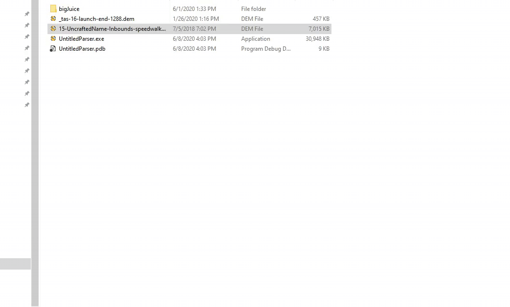

# UncraftedName's Demo Parser
Hey I did the Great Rewrite, so that's pretty cool. This has many names such as UncraftedDemoParser, UntitledParser, and listdemo++.

This is a parser for source engine demos. Currently it explicitly supports Portal 1, Portal 1 Steampipe, Portal 1 3420/leak, Portal 2, some version(s) of L4D2, and HL2 (new engine I think). If you would like support for another version, you can message me or preferably open a new issue. I plan to add support for all versions of L4D2 and L4D1 in the future.

Unfortunately using the parser programatically for anything other than the most basic cases is not terribly simple and there's really no easy-to-use documentation anywhere on the details of the inner structure of demos (see below for the resources I used). So if you would like to find something in a demo, you'll either need to ask me (or someone who knows demos inside and out) or have a lot of fun searching through the code and testing a bunch of demos yourself. In theory the code isn't a complete mess, but it can be extremely difficult to find something you'd want. Here's a single example of how to use the parser in code:
```cs
SourceDemo demo = new SourceDemo("testchmb_a_00.dem");
demo.Parse();
			
demo.FilterForMessageTypeWithTicks<SvcUserMessageFrame>()
  .Where(tuple => tuple.message.UserMessageType == UserMessageType.EntityPortalled)
  .Select(tuple => (tuple.tick, UserMessage: (EntityPortalled)tuple.message.SvcUserMessage))
  .ToList()
  .ForEach(tuple => Console.WriteLine($"[{tuple.tick}]\n{tuple.UserMessage}"));
```
```
[4484]
portal entity index: 82
portal serial num: 296
portalled entity index: 249
portalled entity serial num: 230
new position: <-826.899, -315.774, 192.473>
new angles: <61.679°, 222.367°, 3.838°>

[4543]
portal entity index: 82
portal serial num: 296
portalled entity index: 1
portalled entity serial num: 982
new position: <-831.021, -317.862, 128.031>
new angles: <67.452°, 355.497°, 0.000°>

[6974]
portal entity index: 126
portal serial num: 206
portalled entity index: 1
portalled entity serial num: 982
new position: <-1342.704, -225.013, 577.860>
new angles: <36.342°, 7.766°, 0.000°>
...
```

In this case, it's pretty clear that a portalled entity index of 1 means that the player went through the portal, and any other index means other entities (as of right now I do not have access to which entity specifically that refers to). And by playing the demo back I can confirm that that is what happened. However, not all information in the demo is that simple to understand, and a lot of what I do is guesswork. That information can be incorrect, parsed incorrectly, and/or can heavily depend on the demo version. For instance, this type of user message may have a different value in Portal 2, and might not be interpreted correctly by the parser, or the message type might not exist at all in L4D2 demos. In general, you should take the majority of the information that you might see with a grain of salt unless you have thoroughly tested what you think is true with several demos.

If you would like to build the console app yourself you need .Net core v3.1, and you can use `dotnet publish -r win-x64 -c Release /p:PublishSingleFile=true /p:PublishTrimmed=true`. See https://docs.microsoft.com/en-us/dotnet/core/deploying/deploy-with-cli for more info.


Normally this functions similiarly to listdemo+:
 \
In addition it can be run from the command line with a bunch of other options such as jump detection, verbose demo dumping and a few other things.
 \

Other parsers and resources that I used: 
- https://github.com/NeKzor/sdp.js 
- https://nekzor.github.io/dem#netsvc-message <-- useful for a high level overview
- https://github.com/StatsHelix/demoinfo
- https://github.com/VSES/SourceEngine2007
- https://github.com/alliedmodders/hl2sdk

Note: this incorrectly prints the tick timing - it does not include the 0th tick in the demo. This is to stay consistent with the existing tools such as listdemo+.
